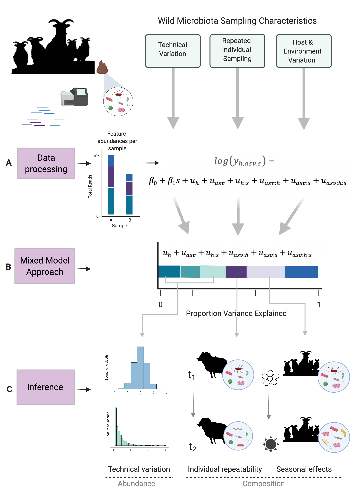

```{r setup, include=FALSE}
knitr::opts_chunk$set(echo = TRUE, 
                      message=FALSE, 
                      warning = FALSE)
```

# Applying GLMMs to wild metabarcoding data 

This is a tutorial illustrating the methods presented in Sweeny et al. 2020 (https://www.biorxiv.org/content/10.1101/2020.11.24.395715v2.full)

We provide an outline of applying generalised linear mixed-effects models to relative abundance tables of metabarcoding data as a means to account for complex covariates that are present in wildlife microbiota datasets. The below from the preprint illustrates the model formulation and output. 

```{r schematic, echo=FALSE, fig.width=4, fig.height=6}

```


For computing efficiency, an anonymised subset of one of the pilot datasets used in the companion manuscript is used in this tutorial and can be downloaded in the 'Data' folder on github. 


# 0. Set-up 

## To run this tutorial you will require the following packages: 

```{r packages}
library(tidyverse) # data manipulation and ggplot 
library(janitor) # data cleaning 
library(magrittr)  # data manipulation 
library(reshape2) # data manipulation 
library(phyloseq) # output format of sequence processing 
library(microbiome) # useful exploration and visualisation functions 
library(MCMCglmm) # implementation of GLMMs 
library(ALDEx2) # CLR transformations 
library(plotrix) # std error functions 
library(pals) # palettes 
library(MetBrewer) # palettes 
library(ggregplot) # package my friend made with lots of handy funcions - https://github.com/gfalbery/ggregplot
```

## Plot admin 

Set-up some palettes for later use 
```{r pals}
MicroColours <- met.brewer("Renoir",12, "discrete")
MicroColoursRamp <- colorRampPalette(MicroColours)
MicroColoursExpand <- MicroColoursRamp(n=20)
MicroColoursCat <- list(
  Age = MicroColours[c(3,4)],
  Sex= MicroColours[c(1,5)],
  Season=MicroColours[c(2,8)]
) #%>% unlist()


AmyTheme <- theme_bw(base_size=14) + 
  theme(
    axis.title = element_text(colour="black"),
    axis.title.x = element_text(angle=45, hjust=1) 
  )

```

## Reading in data objects 

We will use the phyloseq object representing the feature abundance table, metadata, and taxonomy table for exploration of the data and analysis  presented in the first section of the results (alpha and beta diversity). 

We will use the csv object representing the phyloseq objected 'melted' into one dataframe for the mixed modelling approach outlined in Section 3.1

```{r data}
path <- "Data/"
df <- read_csv(paste0(path, "GLMMMTutorialData.csv")) # csv file 
ps <- readRDS(paste0(path,"PhyloseqGLMM.rds")) # phyloseq object 
```

## Explore the dataset 

### Summarise phyloseq object 
This data was previously filtered for a total abundance of 250 reads, so we have no singletons and a total of 794 ASVs and 30 samples we will proceed with. 
```{r data exploration}
ps 
summarize_phyloseq(ps) 
```

### A look at the metadata 
Sample variables include a mix of age classes (15 lamb and 15 adult), males and females, and individuals from the east and west side of the study system. Samples are row names. 
```{r metadata}
sample_data(ps) %>% as.data.frame() %>%  head
```

## Relative abundance and alpha and beta diversity analysis 

### Community composition summary 

By far community dominated by Firmicutes and Bacteroidetes 

```{r relative abundance}
psPhy <- tax_glom(ps, taxrank = "phylum") # aggregates to the phylum level 
psMelt <- psmelt(psPhy) # melts into a combined df for plots 

SampleDepth <- psMelt %>% 
  group_by(Sample) %>% 
  summarise(Depth=sum(Abundance)) %>% as.data.frame() # summarise reads per sample 
RelAbundance <- full_join(psMelt, SampleDepth) %>% 
  group_by(Sample, phylum) %>% 
  summarise(RelAbundance=Abundance/Depth) %>% as.data.frame() # summarise proportion of each phyla for each sample 

require(plotrix)
RelAbundanceMean <- RelAbundance %>% 
  dplyr::select(-Sample) %>%  group_by(phylum) %>% 
  summarise_each(funs(mean, sd, std.error)) %>% 
  arrange(desc(mean)) # summarise proportion of phyla across all samples 

RelAbundanceMean
```

```{r Rel Abundance Plot}
ggplot(psMelt, aes(x = Sample, y = Abundance, fill = phylum)) + 
  geom_bar(stat = "identity", position = "fill", colour="transparent") + 
  scale_fill_manual(values=MicroColoursExpand) + 
  facet_grid(~age_class, scales="free_x") + 
  theme_bw(base_size = 14) + # labs(subtitle = "B") + 
  guides(fill=guide_legend(ncol=2)) +
  theme(axis.text.x = element_text(angle=45, hjust=1, size=6),
        strip.background = element_rect(fill="white"))
```

# 1. Alpha & Beta Diversity Community Analysis 

### Alpha diversity 

Significant differences in diversity between age classes 

```{r alpha diversity}
# alpha metrics 
ps.even <- evenness(ps, index = "all")

ps.meta <- meta(ps)
ps.meta$simpson <- ps.even$simpson 
hist(ps.meta$simpson) 

# test for normality 
shapiro.test(ps.meta$simpson) # p=0.3525 - data not violating normality 
qqnorm(ps.meta$simpson) # looks okay 

# compare between host groups 
SimpsonTestAge<- t.test(ps.meta$simpson[ps.meta$age_class=="Lamb"], ps.meta$simpson[ps.meta$age_class=="Adult"])

SimpsonTestAge # p = 0.0197 
```

#### Visualise alpha diversity differences between age classes 
```{r alpha plot}
require(ggpubr)
alpha.ps <- ps.meta %>% 
  ggviolin(., x="age_class", y="simpson", 
                add = "boxplot", fill = "age_class", 
                palette = c(MicroColoursCat$Sex), 
                alpha=0.6, add.params = list(alpha=0.6), 
                legend = "top") +
  stat_compare_means(method = "t.test", 
                     aes(label=..p.signif..), 
                     label.x=1.5, label.y=0.4,
                     size=7)

alpha.ps
```

### Beta diversiy 

```{r}
ps.rel <- microbiome::transform(ps, "compositional")
bx.ord_pcoa_bray <- ordinate(ps.rel, "PCoA", "bray")

metadf.bx <- data.frame(sample_data(ps.rel))
bray_ps.bxn <- phyloseq::distance(physeq = ps.rel, method = "bray")

set.seed(999)
# Adonis test
library(vegan)
adonis.test <- adonis(bray_ps.bxn ~ age_class, data = metadf.bx)
adonis.test<-clean_names(adonis.test$aov.tab)
```

```{r results, echo=FALSE}
knitr::kable(adonis.test, caption = "PERMANOVA results")
```

#### Visualise composition differences between host groups 

```{r beta plot}
beta.ps <- plot_ordination(ps.rel, 
                             bx.ord_pcoa_bray, 
                             color="age_class"
                             #label = "sample_id", 
) + 
  geom_point(aes(shape = age_class), size= 4) + 
  scale_colour_manual(values=MicroColoursCat$Sex)+
  theme_bw() +
  theme(plot.title = element_text(hjust = 0, size = 12),
        legend.position = "top")+
  stat_ellipse()+
  guides(shape="none")


beta.ps 
```

# 2. Mixed Model Analysis 

Mixed models here will all be carried out in MCMCglmm, but your favourite package/ program should work just fine with some adaptation as well. Feel free to contact me about syntax switches between algorithms. 

## 2A. Poisson GLMMs 

* These models produce the main results of the manuscript and use the raw read count per ASV per sample as the response with Poisson error families 
* Below we also present alternative approaches for computing speed and adjustment of questions asked by the model 

### Model set-up 

* read abundance as response 
* fixed effects should be relevant host factors that may affect sample variation in read abundance - in  this instance samples were collected from adults and lambs to examine effects of age on the gut microbiome 
```{r mcmc poisson setup}
Mods <- list()

mf <- 20 # multiplier for model iterations and chains 
resp<-"abundance" 
fixed<- c("age_class") 

mcmcF<- as.formula(paste(resp, "~", paste(fixed)))
  
Prior3 <- list(R = list(V = diag(1), nu = 0.002),
               G = list(G1 = list(V = diag(1), nu = 0.002, alpha.mu = rep(0,1), alpha.V = diag(1)*100),
                        G2 = list(V = diag(1), nu = 0.002, alpha.mu = rep(0,1), alpha.V = diag(1)*100),
                        G3 = list(V = diag(1), nu = 0.002, alpha.mu = rep(0,1), alpha.V = diag(1)*100)))

```

You can run the model below, or read in the model object which was run from the code! 
```{r Poisson model, eval=FALSE}
# to run the model 
Mods[[1]]<- MCMCglmm(fixed= mcmcF, 
                          random= ~  sample + asv + age_class:asv, 
                          prior=Prior3,
                          data=df,
                          verbose=T, pr=T, pl=T, # will save posteriors for random effect levels & model predictions for each iteration 
                          family = "poisson",
                          nitt = 13000*mf,
                          thin = 10*mf,burnin=3000*mf)

```
Notes: 
* verbose = T will print progress
* pr = T saves posterior distributions for all random effect levels (see section 4) 
* pl = T saves latent variables (model predicted variables for every data point & iteration, useful for testing for excess zeroes)
* Note this did take my laptop ~ 90 minutes to run, so not a fast model! 


Read in the model object here if you didn't run the above 
```{r Poisson model object}
Mods[[1]] <- readRDS("Output/PoissonModel.rds")
```


View proportion variance associated with each random term 
```{r poisson results} 
PropVarPois <- MCMCRep(Mods[[1]], scale="link") %>% # function from ggregplot to calculate proportion variance for each random effect 
  as.data.frame() %>% 
  mutate_at(c("Mode", "lHPD", "uHPD"), as.numeric)

PropVarPois
```


Variance components often will not add to 1 because there is some variance attributable to the poisson process. We'll calculate that and visualise the variance breakdown for this model. 

```{r poisson prop var fig, fig.width = 4}
PropVarPois %>% pull(Mode) %>% sum -> TotalVar 
1- TotalVar -> PoissonVar 

PropVarPois[5, ] <- c("poisson", PoissonVar, NA, NA) 

PropVarPois%>% 
  mutate(Component=fct_relevel(Component, "age_class:asv", "asv", "sample","poisson", "units")) %>% 
  ggplot(aes(x=1, y=as.numeric(Mode), fill=Component)) + 
  geom_bar(stat="identity", colour="transparent") + 
  scale_x_continuous(labels=NULL) + 
  scale_fill_manual(values=MicroColours[c(2,4,6,8,10)]) +
  theme_bw(base_size = 14) + 
  #theme(legend.position = "top") + 
  theme(axis.ticks.x = element_blank(), 
        legend.text = element_text(size=11), 
        legend.title = element_text(size=12)) + 
  labs(x='Poisson model', y='Proportion Variance')
```
# 3. Differential abunance analysis 

* We can use model outputs to explore which specific taxa are driving differential abundances between groups of interests (e.g. age), which is commonly of great interest in microbiome studies
* This can be estimated in the example of age by using each ASV-by- season level of the random effect of asv:season and comparing posterior distributions for each ASV across factor levels
* For example, the mean of the posterior distribution for ASV1:adult – that for ASV1:lamb can be interpreted as the differential abundance of ASV1 between spring and summer

## Rank taxa effects 

Let's pull out the posterior distributions relevant to our host age groups of interest
```{r key taxa solutions}
Solutions<-Mods[[1]]$Sol[, 1:dim(Mods[[1]]$Z)[2]]

SolutionsDF<- Solutions %>% as.data.frame()

SolKeepAge <- SolutionsDF %>% dplyr::select(contains("age_class:asv")) %>% colnames()

SolutionsAge<- SolutionsDF %>% dplyr::select(SolKeepAge) 

SolutionsAdult <- SolutionsAge %>% 
  gather(key="level", value="posterior") %>% as.data.frame() %>% 
  separate(level, into=c("term", "age_class", "asv"), sep="[.]")
```

Here's a function I wrote that you can apply to posterior distributions for each ASV in both age groups to calculate differences between groups (see Section xxx)
```{r key taxa function}
RanefPostComp<- function(df, comps, taxa, var){
  require(tidyverse)
  require(MCMCglmm)
  not_all_na <- function(x) any(!is.na(x))
  df$group <- df[, var]
  df$taxa <- df[, taxa]
  df<- df %>% filter(term!="(Intercept)") %>% 
    mutate(taxa=as.factor(taxa))
  LevelComps<-list()
  Levels=levels(df[, "taxa"])
  for(x in 1:length(Levels)){
    post1 <- df %>% subset(taxa==Levels[x] & group== comps[1]) %>% pull(posterior)
    post2 <- df %>% subset(taxa==Levels[x] & group== comps[2]) %>% pull(posterior)
    if(length(post2>0 ) & length(post1>0)){
      postComp <- post2-post1 %>% as.matrix() 
    }
    else{
      postComp <- rep(NA, 1000)
    }
    LevelComps[[x]] <-postComp
  }
  LevelCompsFin<- bind_cols(LevelComps) %>% as.matrix()
  colnames(LevelCompsFin) <- paste(Levels, comps[[2]], sep=".")
  LevelCompsFin %>% as.data.frame() %>% select_if(not_all_na) -> df 
  
  df1<-apply(df,2, function(a) mean(a)[1])
  df1l<-apply(df,2,function(a)  HPDinterval(as.mcmc(a))[1])
  df1u<-apply(df,2,function(a)  HPDinterval(as.mcmc(a))[2])
  df1v<-apply(df,2,function(a)  var(a)[1])
  
  df2 <- cbind(df1, df1l, df1u, df1v)
  colnames(df2) <- c("mean", "lower", "upper", "var")
  df2 <- df2 %>% as.data.frame() %>% 
    rownames_to_column(var="term") %>% 
    mutate(taxa=sapply(str_split(term, "[[.]]"), '[', 1),
           effect=var, 
           nonZeroCI= ifelse(lower<0&upper<0, "Y", 
                       ifelse(lower>0&upper>0, "Y", "N"))) 
  colnames(df2)[which(names(df2) == "taxa")] <- paste(taxa)
  return(df2)
  
}
```

Let's apply this function to the age-related posterior distributions from the model. This will take a little while to run, especially for datasets larger than this test data! (Or just read them in below)
```{r key taxa age, eval=FALSE}
ASVByAge <- RanefPostComp(SolutionsAdult, 
                          comps=c("Lamb", "Adult"), 
                          taxa="asv", 
                          var="age_class") 

rm(var) # to avoid conflict later with another function 
```

Or read in here: 
```{r key taxa results}
ASVByAge <- read_csv("Output/ASVbyAge.csv")
```

## Visualise taxa effects 

Let's prep the taxonomy rank effects for visualisation with some extra information 
```{r key taxa df}
Taxo <- df %>% filter(!duplicated(asv)) %>% 
  dplyr::select(asv, phylum, fam) %>% as.data.frame() %>% 
  rename(family=fam) # MCMCglmm get's a little cranky if a variable in the df is called family so was renamed previously 

Prev <- df %>% group_by(asv) %>% 
  summarise(prevASV=length(abundance[abundance>0])/ 30) %>%  # n samples 
  arrange(-prevASV)

TaxoDf <- left_join(Prev, Taxo) 

TaxAge <- merge(ASVByAge, TaxoDf, by="asv", all.x=TRUE)
```

Identify taxa with the strongest effects (positive & negative shifts)
```{r ranked taxa figure prep}
TaxAge %>% group_by(phylum) %>% na.omit() %>% 
  summarise(nASV=length(asv)) %>% filter(nASV>1) %>% 
  pull(phylum) %>% as.character() -> keepPhy # retain Phylum with > 1 asv for visualisation 

TopAgeASV<- TaxAge %>% 
  filter(nonZeroCI=="Y") # pull out taxa effects with CI not spanning zero 

Top50 <- TaxAge %>% arrange(-mean) %>% 
  filter(phylum %in% keepPhy) %>% 
  dplyr::select(asv, phylum, lower, upper, mean) %>% 
  #filter(lower>0) %>%  #make sure errors don't span zero 
  top_n(50) %>% 
  mutate(group="real")

Bottom50 <- TaxAge %>% arrange(-mean) %>% 
  filter(phylum %in% keepPhy) %>% 
  dplyr::select(asv, phylum, lower, upper, mean) %>%  
  #filter(upper<0.1) %>% 
  top_n(-50) %>% 
  mutate(group="real")
```

Create some filler categories for the axis breaks for creating a panel with highest ranked taxa (see Fig 2B & 2D)
```{r figure filler}
DummiesAge<-paste0("dummy", rep(1:25))
GroupAge<-rep("dummy", 25)

DummyAge<- cbind(DummiesAge, GroupAge) %>% as.data.frame()
colnames(DummyAge)<- c("asv", "group")

select50<- bind_rows(Top50, DummyAge, Bottom50) 
select_x_age<- select50 %>% pull(asv)
```

```{r diff abundance fig code}
MicroColoursPhy <- MicroColours
PlotPal <- data.frame(keepPhy, MicroColoursPhy[c(1,3,4:10,12)])
colnames(PlotPal) <- c("phylum", "colour")

AgeTopBottom<-
  select50 %>% filter(!is.na(phylum)) %>% 
  ggplot(aes(x=reorder(asv, mean), y=mean, colour=phylum))+
  geom_point(position=position_dodge(w=0.4), size=1.5)+
  geom_errorbar(position=position_dodge(w=0.5),
                aes(ymin=lower,ymax=upper),size=0.3,width=0.2)+
  geom_segment(aes(y=0, yend=0, x=120, xend=70), colour="black", size=0.7)+
  geom_segment(aes(y=0, yend=0, x=70, xend=50), linetype="dashed", colour="black", size=0.7)+
  geom_segment(aes(y=0, yend=0, x=50, xend=0), colour="black", size=0.7)+
  #geom_hline(aes(yintercept=0, linetype=group))+
  theme_classic(base_size = 14)+labs(x=NULL)+
  scale_colour_manual(values=PlotPal %>% 
                        filter(phylum %in% select50$phylum) %>% 
                        mutate(colour=as.character(colour)) %>% 
                        pull(colour), 
                      breaks=unique(as.character(select50$phylum)) %>% 
                        sort()) + 
  scale_x_discrete(limits=rev(select_x_age))+
  #geom_vline(aes(xintercept=50.5, colour="grey"), size=0.2) + 
  coord_flip()+
  theme(strip.text.x = element_text(size = 0.8), 
        strip.background =element_rect(fill="white"),
        axis.text.y = element_blank(), 
        axis.ticks.y=element_blank())+
  labs(subtitle = "B")

TaxAge  %>% na.omit() %>% subset(phylum %in% keepPhy) -> SinaDFAge

AgeSina<-
  ggplot() +
  geom_violin(data=SinaDFAge,
              aes(y=mean, x=phylum, fill=phylum), 
              colour="transparent", alpha=0.2) + 
  ggforce::geom_sina(data=SinaDFAge,aes(y=mean, x=phylum, size=1/var, colour=phylum), alpha=0.3) + 
  scale_size(range=c(0.15, 3), name="Inverse Variance") +
  scale_colour_manual(values=PlotPal %>% 
                        filter(phylum %in% SinaDFAge$phylum) %>% 
                        mutate(colour=as.character(colour)) %>% 
                        pull(colour), 
                      breaks=unique(as.character(SinaDFAge$phylum)) %>% 
                        sort()) + 
  scale_fill_manual(values=PlotPal %>% 
                        filter(phylum %in% SinaDFAge$phylum) %>% 
                        mutate(colour=as.character(colour)) %>% 
                        pull(colour), 
                      breaks=unique(as.character(SinaDFAge$phylum)) %>% 
                        sort()) + 
  geom_hline(yintercept=0, linetype="dashed")+
  theme_bw(base_size = 14) + 
  #coord_flip() +theme_ipsum(base_size = 10) + 
  theme(axis.text.x = element_text(angle=45, hjust=1), 
        axis.title.x = element_blank(),
        legend.position = "top")+ #+facet_wrap(~phylum) +
  guides(colour=FALSE, fill=FALSE)

AgeSinaRect <- AgeSina+
  geom_rect(data=Top50, 
            aes(xmin=0.75, xmax=10.25, ymin=min(mean-0.15), ymax=max(mean+0.25)),
            fill="transparent", color="grey60",size=0.5) +
  geom_rect(data=Bottom50,
            aes(xmin=0.75, xmax=10.25, ymin=min(mean-0.30), ymax=max(mean+0.25)),
            fill="transparent", color="grey60",size=0.5)+
  labs(subtitle = "A")

```

We can now visualise a plot comparable (but with fewer ASVs) to Figure 2 in the manuscript, where the highest ranked positive and negative shifts are highlighted by the rectangle in panel A & panel B forest plot.

As in the manuscript, although there is a lot of variation within phlya, the majority of highly positive shifts (increases into adulthood) are found in the Bacteroidetes, and the majority of the highly negative shifts (decreases into adulthood) are found in the Firmicutes. 

```{r diff abundance fig, fig.width = 10, fig.asp= 0.7}
require(patchwork)

AgeSinaRect + AgeTopBottom
```


# 4. Model Extension Examples 

## 4A. Gaussian GLMMs 

### CLR Transformation Background 

* The CLR takes the form of the log-ratio of the count for a given taxon in a given sample and the geometric mean of the counts of all taxa in that sample
* This transformation has several desirable properties: 
 + As a log-ratio it is approximately Gaussian in distribution, allowing the use of a Gaussian linear mixed model
 + Secondly, the mean of the CLR of all taxa in any sample will be zero, allowing for simplification of our random effects structure (i.e. removal of random effects not dealing with taxa)
 + CLR is increasingly used for microbiome analyses for it's explicit acknowledgement of read abundances as compositional (Gloor et al 2017)
 
* Below we use the package 'ADLEx2' (Fernandes et al 2013) to calculate a centered log-ratio for each ASV in each sample. 
* In addition to CLR values, ALDEx2 estimates technical variation for each ASV from a probability distribution using Monte-Carlo instances drawn from the Drichlet distribution, which maintains the compositional nature of the data.
* This variance for each asv:sample level can be incorporated as measurement error in the MCMCglmm syntax, comparable to the 'asv:sample' term in the Poisson models (3A).
* Further details of CLR models can be found in ESM section 2. 

### CLR data prep 
#### Put data in correct (matrix format)
```{r clr prep}
df_t <- df  %>% 
  dplyr::select(asv:abundance) %>% 
  spread(sample, abundance) # spread data to wide format 

df_m <-df_t %>% 
  column_to_rownames("asv") %>% 
  as.matrix() # turn into a matrix 
```

#### Calculate CLR values and associated error 

The below will create a transformed dataframe, or can read in the CLR format data in the next code chunk
```{r clr transform, eval=FALSE}
n_sample<-length(unique(df$sample)) #30 
x<-aldex.clr(df_m,as.character(seq(1,n_sample)), mc.samples=128, denom="all", verbose=F) # run ALDEx2

y<-melt(getMonteCarloInstances (x)) # extract the data
colnames(y)<-c("asv","mcmc_instance","clr","sample") # tidy for df 

z<-aggregate(y$clr,by=list(y$asv,y$sample),FUN=mean) # take mean across monte-carlo samples
meas_var<-aggregate(y$clr,by=list(y$asv,y$sample),FUN=var) # calculate variance across monte-carlo samples
z$sd<-meas_var$x # add variances to data frame
colnames(z)<-c("asv","sample","clr","meas_var") # correct dimensions 
mean(z$clr) #  will be very close to zero

meta<- df %>% 
  dplyr::select(sample, asv, phylum, abundance, id, age_class, sex) 

CLR <- merge(z, meta, by=c("asv", "sample"), all.x=TRUE) #looks good 
```

```{r clr data}
CLR <- read_csv("Data/GLMMMTutorialDatasetCLR.csv")
```

#### Visualising CLR: What's going on in the above code 

Each ASV per sample ends up with a CLR value taking into account the abundance of all other ASVs in the sample and a distribution of possible values, from which error around the CLR estimate is obtained 

```{r CLR plot, eval=FALSE}

asvs<- paste0("ASV", seq(1:50)) %>% sample(., size=5)

meanCLR <- z %>% mutate(meanCLR=clr) %>% 
  dplyr::select(asv, meanCLR, sample) %>%
  filter(asv %in% asvs) %>% 
  mutate(sample_asv=paste(asv, sample, sep="-")) 

y_t<-y %>% 
  mutate(sample_asv=paste(asv, sample, sep="-")) %>% 
  filter(asv %in% asvs) 

ridges <- merge(y_t %>% dplyr::select(-c("asv", "sample")), meanCLR, by=c("sample_asv"), 
                 all.x=TRUE, all.y=FALSE) %>% 
  arrange(meanCLR, mcmc_instance) %>% 
  mutate(order=row_number())

require(ggridges)
clr_posteriors <- ridges %>% 
  ggplot(aes(x=clr, y=reorder(sample_asv,-meanCLR), group=sample_asv)) +
  scale_x_continuous(limits=c(-15,15))+
  geom_density_ridges(scale=5, size=0.25)+
  theme_minimal() + 
  geom_vline(xintercept = 0, linetype="dashed")+
  theme(axis.text.y = element_blank()) + labs(y="asv", x="clr")

clr_posteriors
 
```

### CLR model set-up 

```{r mcmc gaussian setup}
mf <- 20 # multiplier for model iterations and chains 

Prior2 <- list(R = list(V = diag(1), nu = 0.002),
               G = list(G1 = list(V = diag(1), nu = 0.002, alpha.mu = rep(0,1), alpha.V = diag(1)*100),
                        G2 = list(V = diag(1), nu = 0.002, alpha.mu = rep(0,1), alpha.V = diag(1)*100)))

```

```{r gaussian model, eval=FALSE}
Mods[[2]] <-MCMCglmm(clr~ 1,
                  random=~ age_class:asv + asv, # note sample does not need to be included here 
                  mev=CLR$meas_var, # measurement error variance 
                  data=CLR,
                  prior=Prior2,
                  verbose=T, 
                  pr=F, pl=F, 
                  nitt= 13000*mf, 
                  thin=10*mf, burnin=3000*mf) # start time 1714 finish 
```
Notes: 
* this also takes a fair bit of time (~40 min for me) but will be more efficient for more complex random effect structures 
* pr & pl are set to F for the purposes of this tutorial, but if you want the posteriors/ predictions saved, set to T 

Read in the model object here if you didn't run the above 
```{r gaussian model object}
Mods[[2]] <- readRDS("Output/GaussianModel.rds")
```


```{r gaussian results} 
PropVarCLR <- MCMCRep(Mods[[2]]) %>% 
  as.data.frame() %>% 
  mutate_at(c("Mode", "lHPD", "uHPD"), as.numeric) 

PropVarCLR[3,1] <- "mev"
```

We can compare these variance components to the those of the Poisson model and se 

## 4B. Hierarchical Taxonomic Effects

* Poisson and CLR models introduced above ask how the asv community varies between age groups, and identify specific asvs which contribute to these differences and may warrant further investigation. 
* Differential abundance results in this manuscript (Figure 2) & tutorial (above) indicate that there is a high degree of variation for effects of asvs, even within the same phylum when visualised grouped 
* We therefore were further interested in from which taxonomic level most variation arises for observed effects. 
* Here we show an alternative to the Poisson model above which considers additional taxonomic levels (ASV, family, phylum) as an example of one approach. 
* We note that this nested taxonomic effects approach is not the only way, and that fitting a phylogenetic tree in the random effects structure offers an additional option which explictly accounts for phylogenetic distance. 

